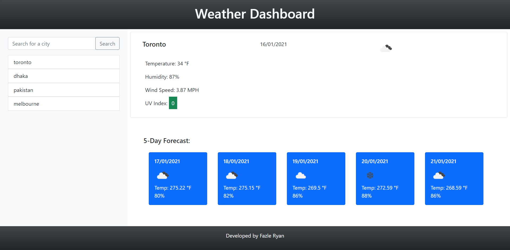

# weather-dashboard
# Screenshot:

### A traveler I can see the weather outlook for multiple cities to plan a trip accordingly
### Form inputs establised to search cities
### WHEN city is searched then we are presented with current and future conditions for that city and that city is added to the search history
### WHEN weather conditions is viewed for that city we are presented with the city name, the date, an icon representation of weather conditions, the temperature, the humidity, the wind speed, and the UV index
### WHEN UV index is viewed THEN we are presented with a color that indicates whether the conditions are favorable(green), moderate(orange), or severe (red)
### WHEN future weather condition is viewed for that city THEN we are presented with a 5-day forecast that displays the date, an icon representation of weather conditions, the temperature, and the humidity
### WHEN a city in the search history is clicked THEN we are again presented with current and future conditions for that city
### Additional info:
- getLocalTime function created to get local time based on timezone
- nested loop created to get uv index by inputting lon and lat
- weather api icons used in both current and future weather info
- data saved as array text in local storage
- if city not found an alert message appears
- event listeners created for click button and click list items